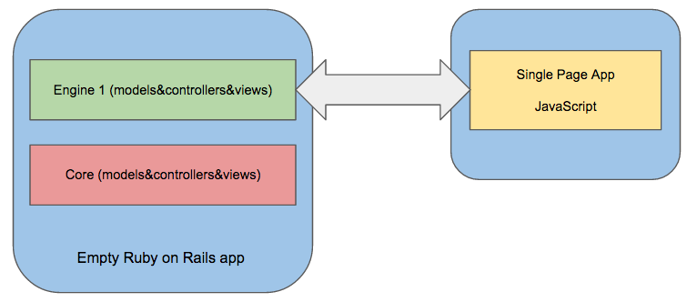
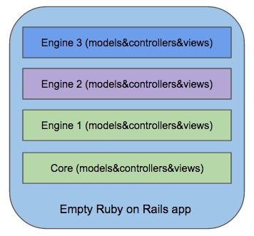

# Rails engine, modular way — Introduction

This posts is about modularity in Ruby on Rails and Rails Engine, so, I gonna introduce some terms. 

> If you want an introduction for Rails Engine check this resource(http://guides.rubyonrails.org/engines.html).

All gems start with a namespace, Rails engine are gems. Ruby app dont start with a namespace.

## Modularity

“Modularity is the degree to which a system’s components may be separated and recombined” — **Wikipedia**

For example, we could say a car is a modular object. It is composed of various pieces, such as the ENGINE, CHASSIS, TIRES, etc…

“Modular programming is a software design technique that emphasizes separating the functionality of a program into independent, interchangeable modules, such that each contains everything necessary to execute only one aspect of the desired functionality.” — **Wikipedia**

Ruby on Rails is now composed of a set of modules:

- Active Record
- Active Model
- Active Support
- Action View
- Action Pack
- Action Mailer
- Active Job

## Rails Engines

Engines are basically miniature Ruby on Rails application that can provide new functionalities to the parent application including them. The class defining a Ruby on Rails application is Rails::Application which inherits a lot of its behavior from Rails::Engine which defines an engine.
A Ruby on Rails application is just a bit more than a Rails engine, coming with the logic required to run on its own. First of all, they share the same structure.

- Models
- Views
- Controllers
- Assets
- Tests

***Examples of Engines***

- Devise(https://github.com/plataformatec/devise)
- Forem(https://github.com/rubysherpas/forem)
- Spree Ecommerce(https://github.com/spree/spree)

***Monolitich application***
Regular Ruby on Rails application are monolithic applicatons. They are self-contained applications that will do what you programmed them for.

In software engineering, a monolithic application describes a software application which is designed without modularity. -***Wikipedia***

***Three tier modules***
Three-tier architecture is a client– server architecture in which the user interface (presentation), functional process logic (“ business rules”),
computer data storage and data access are developed and maintained as independent modules, most often on separate platforms. — Wikipedia

***Full Component Based***

Never build a large apps.

The secret to building large apps is never build large apps. Break your applications into small pieces. Then, assemble those testable bitesized pieces into your big application. — Justin Meyer

For understand this concept Stephan Hagemann’s excellent talk from last year’s MountainWest RubyConf: Component-based Architectures in Ruby and Rails(http://www.confreaks.com/videos/2350-mwrc2013-component-based-architectures-in-ruby-and-rails).

Basically each component is a Rails engine

---

## Extending an Engine

- Models
Can be extended using decorator and `clas_eval`.

- Views
Can be extended with `Deface` gem

- Controllers
We’ll two gems in the parent app: 

Gemfile

    gem ‘modular_engine’
    gem ‘deface’

run bundle install.

## Extending models

Extending models is too easy. Thanks to Ruby open classes technique. You can always reopen existing classes, even standard library classes such as ***String*** or ***Array***.
The decorator folder

To keep it organized, we’ll extend models and controllers in files called decorators.

For this example we’ll use ***Demo*** such us namespace.

By using the `modular_engine` generator, you should have a decorators folder in your engine app/ folder. In there, you will find two more folders: models and controllers. We’re going to create one decorator for each class that we want to extend. but first, let’s make sure our decorators will be loaded by ***Rails*** automatically.

***Load the decorators***

Open the ***engine.rb*** file in the child engine

    config.to_prepare do
      Dir.glob(Engine.root.join("app", "decorators", "**", "*_decorator*.rb")) do |c|
        Rails.configuration.cache_classes ? require(c) : load(c)
      end
    end
    
    

## Extend views

We are going to extend the views that are in the ***core*** engine from de ***child*** engine. We are going to use a gem called ***Deface***.

First, we need to add the Deface gem to our engine gemspec

    # Dwl/engines/contacts/dwl_contacts.gemspec
    s.add_dependency "deface", '~ > 1.0.1' 

    # core/app/views/layouts/dwl/application.html.erb
    <li data-dwl-hook ='main_nav' class =" <%= active( dwl.root_path) %>">
      <%= link_to 'Home', samurai.root_path %>
    </li >

***Create override***

    # Dwl/engines/contacts/overrides/add_contacts_link_to_nav.rb
    Deface::Override.new(:virtual_path => "layouts/dwl/application",
                        :name => "add_orders_link_to_nav",
                        :insert_after => "[data-dwl-hook='main_nav']",
                        :partial => "overrides/orders_link",
                        :namespaced => true,
                        :original => 'f5fe48b6dc6986328e0b873b3ffa1b228dd52a7c')

***Create a view for the override***

Using Deface::Override - this is the traditional method whereby you define instances of the Deface::Override class directly.

    # engines/orders/app/views/dwl/orders/overrides/_orders_link.html.erb
    <li class="<%= active(dwl.orders_path) %>">
      <%= link_to 'Orders', dwl.orders_path %>
    </li>

---

## How to section

- Migrations
- Associations

Migrations

Create migration from engine you need to change and run `rake db:migrate` from parent app.

Associations

Associations between different engines, the first engine has a User model, the second engine has a Order model.

First engine contains User model:

    module Dwl
     class User < ApplicationRecord
       has_many :orders
     end
    end

Create a decorator for User model

Now let’s go to use a simple decorator and `class_eval`:

    Dwl::User.class_eval do
     has_many :orders, class_name: Dwl::Orders::Order
    end
